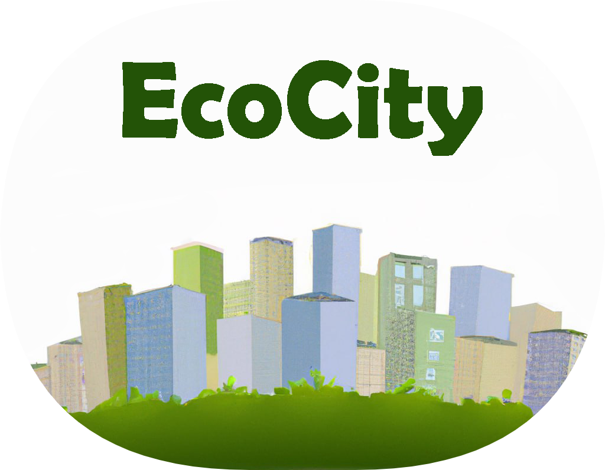

# EcoCity DApp
Welcome to our DApp EcoCity built on web 3.0, a decentralized game that interacts with the blockchain. Our DApp has been created for the Blockchain and Distributed Ledger Technologies course (A.Y. 2022-2023).

## Introduction
Our DApp is a management game where players own and manage a sustainable community. The main objective of the game is to encourage players to make their community sustainable by investing "ECOs" in 15 eco-sustainable resources during each daily round. Players must face all 7 environmental challenges, and unexpected natural events of varying severity can occur, testing the community's resilience. To succeed, players must make the best decisions to overcome these challenges.

In the game, players can create their community and cannot have two communities simultaneously. They can sell their community in the Shop and then purchase a new one by paying with ETH.

Our DApp is an interactive way for players to learn about sustainable practices while having fun. We hope you enjoy the experience and gain a better understanding of how to build a sustainable community.

## Requirements
To play EcoCity, you will need:

1)The [Solidity](https://docs.soliditylang.org/en/v0.8.11/) programming language and an Integrated Development Environment (IDE) to write the smart contract containing the game logic. We recommend using [Visual Studio Code](https://code.visualstudio.com/), which can be used offline. Alternatively, you can use [Remix](https://remix.ethereum.org/), but it requires an online connection. 

2)[NodeJS](https://nodejs.org/en/) as a dependency.

3)[Ganache UI](https://www.trufflesuite.com/ganache), which allows you to simulate a blockchain environment and interact with the smart contract using up to 10 different accounts, each with 100 ETH. Ganache UI comes with a user-friendly interface.

4)[Truffle](https://www.trufflesuite.com/truffle), which can be installed globally with `npm install -g truffle`, to compile and deploy the smart contract.

5)EcoCity was built using the [React](https://reactjs.org/) framework and the ["@chakra-ui"](https://chakra-ui.com/) template, which utilizes the chakraUI library to provide pre-built UI components. The project also utilizes ["react-router-dom"](https://reactrouter.com/web/guides/quick-start) for routing between pages and ["chakra-ui/icons"](https://chakra-ui.com/docs/components/icon) for displaying icons within buttons.

6)[Metamask](https://metamask.io/), a browser extension that allows you to log in and access the EcoCity DApp.

## Setup and run the DApp
To set up and run the EcoCity DApp, follow these steps:

0)Make sure to install the project using `npm install`.

1)First, run Ganache on port 7545. In the Settings page, click on "add project" and select the `truffle-config.js` file located in the project folder. This will connect Ganache to the project.

2)Next, in the console (in the root directory of the project), enter `truffle compile` to compile the contract.

3)Then enter `truffle migrate --reset` to deploy the contract (also from the root directory of the project). This command runs the script in the "migrations" folder. After this, you should see the EcoCity contract listed as "Deployed" in Ganache's list of contracts. The smart contract has been added to the local Ethereum blockchain provided by Ganache, and by default, the "owner" will be the first account on Ganache.

4)The compile command generated the `EcoCity.JSON` file inside the "build" folder. This file needs to be copied to the "src" folder, because React unfortunately doesn't allow files to be read outside of the "src" folder.

5)In the `Contract.js` file, enter the address of the new contract in the appropriate space. This address can be obtained directly from the console after deploying, or in the "Contracts" section of Ganache.

6)Run the DApp by entering `npm start` in the console, which will open the page "http://localhost:3000/".

7)Add one of the accounts provided by Ganache to your Metamask wallet to log in. To do this, import the private keys that can be obtained from each account in Ganache. We invite you to test the DApp with as many accounts as you like, remembering that each account can own a maximum of one community. And have fun! 😄

## Authors

- [@Alberto Cotumaccio](https://github.com/albertoCotumaccio)
- [@Giovanni Montobbio](https://github.com/montobbioGiovanni)

